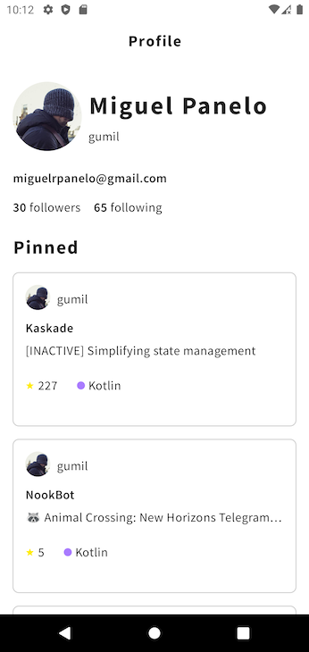
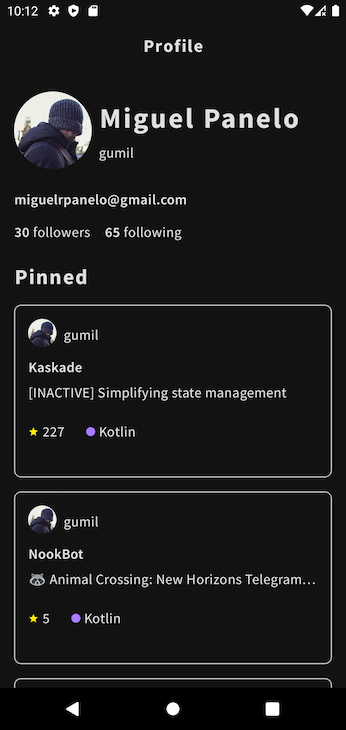
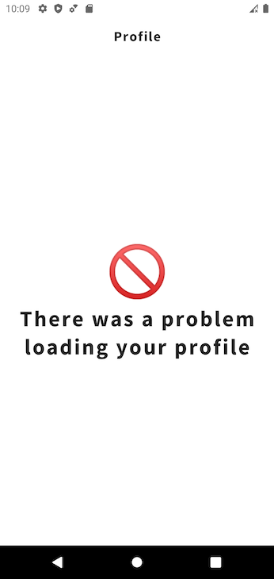
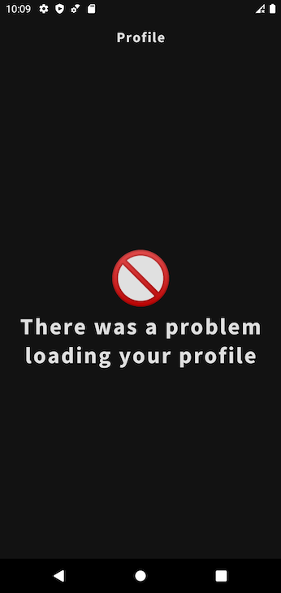

# Profiles
An app to explore Github's GraphQL API.

## Setup
Add clientId and token to local.properties:
```
token=<YOUR_TOKEN>
```

## Screenshots
 
 

## Technology
* **Apollo GraphQL** - gets data using `Apollo GraphQL` and `HttpCache` to cache response for 1 day.
* **Multi-module setup** - `data` and `app` modules are separated to create proper abstraction between the two.
* **Dagger Hilt** - uses Dagger Hilt to create the dependency graph and create them on the app module
* **Kotlin Coroutines** - uses `Coroutine FLows` and `suspended` functions for asynchronous calls.
* **MVVM** - uses the Android `ViewModel` to expose `Coroutine FLows` of data to the UI.
* **Jetpack Compose** - This project showcases how Jetpack Compose can be used to build beautiful UIs.
